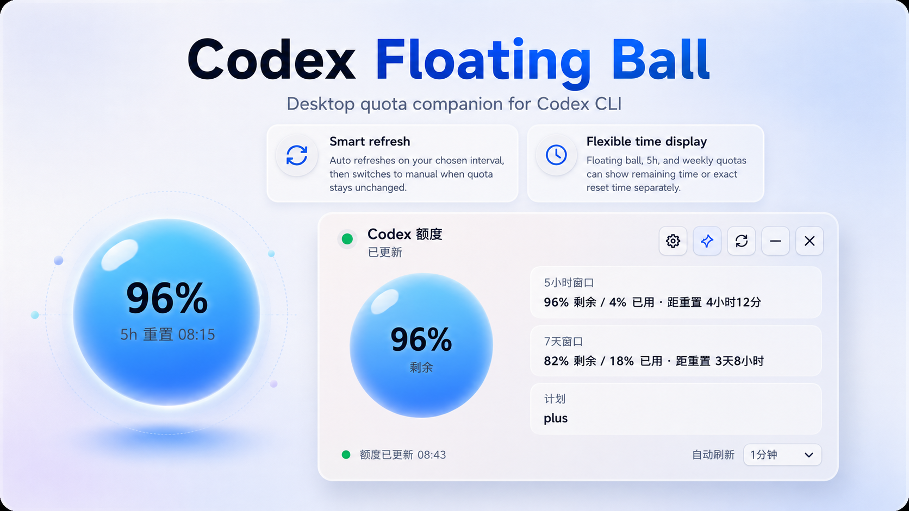
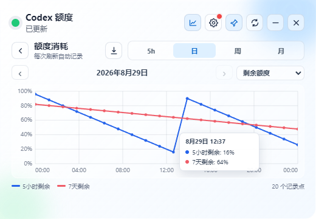

# Codex Floating Ball

> A lightweight, privacy-friendly desktop companion for monitoring local Codex CLI usage quotas on Windows and macOS.

[](../../releases/latest)
[](LICENSE)


**[Download Latest Release](../../releases/latest)** · [中文](#中文说明) · [English](#english)

> **Privacy:** Codex Floating Ball reads quota information locally through the Codex CLI. It does not request, store, or upload your Codex Token.

<p align="center">
  
</p>

---

## 中文说明

Codex Floating Ball 是一个用于查看本机 Codex 使用额度的 Windows 与 macOS 桌面悬浮组件。

它以一个轻量悬浮球作为日常状态，需要更多信息时可以单击展开完整面板，查看额度、重置时间、刷新状态和相关设置。

> 本项目 Fork 自 [xicunwus2025-sys/codex-led-widget](https://github.com/xicunwus2025-sys/codex-led-widget)，在保留原项目 MIT 协议和 attribution 的基础上进行了独立的功能、交互与跨平台增强。感谢原项目作者。

### 为什么做这个项目

在持续使用 Codex 时，频繁切换窗口查看剩余额度并不方便。

Codex Floating Ball 希望提供一个轻量、常驻桌面且尽量不打扰工作的 companion tool，让用户可以随时了解 Codex 剩余额度、重置时间和当前刷新状态。

项目采用本地优先的方式读取额度信息：

- 通过本机已登录的 Codex CLI 获取额度数据
- 不要求用户输入 Codex Token
- 不保存 Codex Token
- 不上传 Codex Token

---

### 项目亮点

#### v1.1.1：历史图表交互与 CSV 导出

v1.1.1 进一步完善额度历史页面。图表现在可以在 **消耗额度** 与 **剩余额度** 之间自由切换，两种模式都使用统一的 `0–100%` 纵轴，并会记住最后一次选择。鼠标移到采样点附近时，悬停提示会显示具体采样时间以及 5 小时和 7 天额度的精确数值，并自动调整位置以避免超出图表边界。

历史页面还新增 CSV 导出按钮，可将本机保存的全部有效记录导出到用户选择的位置。导出内容包括采样时间、两个额度窗口的剩余/已用百分比及重置时间，可直接使用 Excel 或其他表格软件打开。升级不会删除已有历史，记录仍只保存在本机。

<p align="center">
  
</p>

#### v1.1.0：低频采样与更新提醒

v1.1.0 扩展了智能刷新机制。额度在设定时间内没有变化后，可以切换为 **手动刷新、每 30 分钟采样或每 60 分钟采样**；低频采样检测到额度再次变化，或用户主动刷新后，会自动恢复活跃刷新间隔。主界面会显示当前实际刷新频率，重新选择分钟数也可以立即恢复活跃模式。

应用还加入了可选的 GitHub Release 更新检查。自动检查默认开启，每 24 小时检查一次；发现新版本时会显示系统通知和设置按钮红点，也可以在设置页随时手动检查。该功能只访问本项目的 GitHub Releases API，不会发送额度、Codex Token 或账户信息。

#### v1.0.0：额度历史与可调悬浮球

v1.0.0 会在每次成功刷新时，将 5 小时和 7 天额度快照追加保存到本机应用数据目录。历史页面支持按 **日、周、月、5 小时周期** 查看两条额度消耗折线，并可前后切换到更早的时间段。

悬浮球现在还可以分别调整：

- 球体直径（`88–200 px`）
- 额度数字字号
- 重置时间字号

应用会根据球体尺寸自动限制字号和布局，避免两行文字重叠。历史数据仅保存在本机，不会上传。

#### 智能刷新

普通的额度监控工具通常只能按照固定时间间隔持续轮询。Codex Floating Ball 提供了一套更适合实际 Codex 工作流的 **Smart Refresh / 智能刷新机制**。

你可以分别设置：

- **活跃刷新间隔**，例如每 `1 分钟` 自动刷新一次额度
- **额度无变化超时**，用于判断当前是否已经停止持续使用 Codex

在运行 Codex 项目或长任务期间，组件会按照设定的间隔持续更新额度，方便及时观察额度变化。

如果经过设定时间后额度始终没有变化，组件会根据设置自动进入：

**活跃刷新 → 手动模式或低频采样模式**

低频采样可选择每 30 分钟或每 60 分钟检查一次。这样在 Codex 工作结束后，组件不会继续长期在后台按分钟重复查询，同时仍能发现新的额度变化。

当你再次：

- 双击悬浮球
- 点击手动刷新

智能自动刷新会重新启用。低频采样检测到额度变化时也会自动恢复活跃间隔。

这使组件能够在两种状态之间自动切换：

**活跃使用 Codex → 高频关注额度变化**

**停止使用 Codex → 手动模式或低频采样，减少不必要的后台刷新**

主界面的刷新间隔选择器与设置页面中的智能刷新配置保持同步，并会显示手动、30 分钟或 60 分钟等当前实际频率；重新选择分钟数即可恢复活跃刷新。

#### 灵活的重置时间显示

不同额度窗口适合不同的时间表达方式。

Codex Floating Ball 支持对以下位置 **分别独立设置** 重置时间的显示方式：

- 悬浮球
- 5 小时额度
- 7 天 / 周额度

每一处都可以选择：

**显示距离重置还有多久**

例如：

```text
4小时12分
```

或者：

**显示具体重置时刻**

例如：

```text
08/18 08:15
```

三处设置互相独立。

例如，你可以让：

- 悬浮球显示具体重置时刻
- 5 小时额度显示剩余小时
- 周额度显示具体日期和时间

这样既适合快速判断“还要多久恢复额度”，也方便根据具体重置时间规划后续 Codex 使用。

> Codex 实际提供的额度窗口可能随官方策略发生变化。组件显示的额度数据以本机 Codex CLI 当前能够提供的信息为准。

---

### 主要功能

- 以紧凑悬浮球作为默认桌面状态，快速查看剩余额度。
- 单击悬浮球展开完整额度面板。
- 双击悬浮球立即刷新额度。
- 可直接拖动悬浮球到桌面任意位置，并自动记住位置。
- 完整面板失去焦点后自动返回悬浮球状态。
- 支持 5 小时和 7 天 / 周额度信息显示。
- 自动记录每次成功刷新的额度快照，并按日、周、月或 5 小时周期显示历史曲线。
- 支持回溯更早的历史周期；历史记录仅保存在本机应用数据目录。
- 历史图表可切换显示消耗额度或剩余额度，并记住最后一次选择；两种模式均使用统一的 `0–100%` 刻度。
- 鼠标悬停在历史采样点附近时，可查看采样时间以及 5 小时和 7 天额度的精确数值。
- 可将全部有效历史记录导出为 CSV，包含采样时间、剩余/已用百分比和重置时间，文件只会写入用户选择的位置。
- 悬浮球直径、额度字号和重置时间字号可分别调整，并自动避免文字重叠。
- 悬浮球、5 小时额度和周额度可分别设置为显示剩余时间或具体重置时刻。
- 支持智能刷新，可配置活跃刷新间隔、额度无变化超时和无变化后的采样频率。
- 额度长期无变化后可切换为手动、30 分钟或 60 分钟低频采样；检测到额度变化、手动刷新或双击悬浮球后恢复活跃刷新。
- 主界面的刷新间隔与设置页同步，并显示当前实际刷新频率。
- 可选的自动更新检查每天查询一次 GitHub Releases；发现新版时显示系统通知和设置按钮红点，也支持手动检查。
- 可设置周额度预警阈值。
- 周额度低于设定阈值时，可通过额外告警提示提醒用户。
- 支持中文 / English。
- 支持浅色 / 深色主题。
- 使用托盘图标，不会在任务栏长期占用普通窗口位置。
- 悬浮球采用高质量圆形渲染，在高分辨率和桌面缩放环境下保持更平滑的边缘效果。
- Windows 与 macOS 均提供对应构建。

---

### 下载与使用

请前往 **[Releases](../../releases/latest)** 下载最新版本。

| 平台 | 安装包 |
| --- | --- |
| Windows 10/11 x64 | `Codex-Floating-Ball-*-win-x64.exe` |
| Apple Silicon Mac | `Codex-Floating-Ball-*-mac-arm64.dmg` |
| Intel Mac | `Codex-Floating-Ball-*-mac-x64.dmg` |

#### Windows

1. 下载 Windows x64 `.exe`。
2. 双击运行 Codex Floating Ball。
3. 等待组件读取本机 Codex 使用额度。
4. 拖动悬浮球到合适的位置。
5. 单击查看详细额度和设置，双击立即刷新。

#### macOS

1. 根据 Mac 架构下载 Apple Silicon `arm64` 或 Intel `x64` `.dmg`。
2. 打开 `.dmg`，将 Codex Floating Ball 拖入“应用程序”。
3. 启动应用并等待读取本机 Codex 使用额度。

当前 macOS 构建未使用 Apple Developer 证书签名或公证。

如果首次启动被 macOS 阻止，请前往：

**系统设置 → 隐私与安全性 → 仍要打开**

> macOS 构建目前主要通过 GitHub Actions 生成，尚未在大量真实 Mac 设备上完成兼容性验证。如遇问题，欢迎通过 [Issues](../../issues) 反馈。

---

### 运行要求

- Windows 10/11，或 macOS 12 及以上版本
- 本机已安装并登录 Codex CLI 或兼容的 Codex 桌面环境
- Node.js 与 npm（仅从源码运行或构建时需要）

本组件通过本机 Codex CLI 读取额度信息，不要求、不保存，也不会上传你的 Codex Token。

---

### 从源码运行

安装依赖：

```bash
npm install
```

启动：

```bash
npm start
```

运行测试：

```bash
npm test
```

生成 Windows x64 版本：

```powershell
npm run build:win
```

生成 Intel 与 Apple Silicon macOS `.dmg`：

```bash
npm run build:mac
```

生成用于本机测试的解包目录：

```bash
npm run build:dir
```

如果没有 Mac，可以在仓库的 **Actions** 页面手动运行 `Build macOS packages`，完成后下载对应的 `arm64` 和 `x64` 构建产物。

---

### 参与贡献

Bug 报告、功能建议、文档改进和 Pull Request 都欢迎。

开始贡献前请阅读：

- [CONTRIBUTING.md](CONTRIBUTING.md)
- [SECURITY.md](SECURITY.md)

如果发现可能涉及 Token、凭证、本地文件访问、命令执行或其他安全边界的问题，请不要在公开 Issue 中发布敏感信息。

---

## English

Codex Floating Ball is a Windows and macOS desktop companion for monitoring the usage quota of the locally installed Codex CLI.

It stays compact as a floating desktop ball during normal use and expands into a detailed quota panel when more information or controls are needed.

> This project is a fork and independently maintained enhanced edition of [xicunwus2025-sys/codex-led-widget](https://github.com/xicunwus2025-sys/codex-led-widget). It retains the upstream MIT license and attribution while adding independent functionality, interaction improvements, and cross-platform support.

### Why this project exists

Frequently switching windows just to check remaining Codex quota is inconvenient during active development.

Codex Floating Ball provides a lightweight, always-available desktop companion for keeping quota status, reset timing, and refresh state visible without interrupting the coding workflow.

The project follows a local-first approach:

- Quota information is read through the locally installed Codex CLI
- It does not ask for your Codex Token
- It does not store your Codex Token
- It does not upload your Codex Token

---

### Highlights

#### v1.1.1: interactive history charts and CSV export

Version 1.1.1 expands the history view with a selector for **quota used** or **quota remaining**. Both modes share a consistent `0–100%` vertical scale, and the latest selection is remembered. Hovering near a recorded point shows its timestamp and the exact 5-hour and 7-day values; the tooltip repositions itself to stay inside the chart.

The history page also adds CSV export for every valid local record. Exports include timestamps, remaining and used percentages for both quota windows, and their reset times, and are written only to the location selected by the user. Existing history is preserved during upgrades and remains local.

<p align="center">
  
</p>

#### v1.1.0: idle sampling and update notifications

Version 1.1.0 extends Smart Refresh with **Manual, 30-minute, and 60-minute idle sampling modes** after quota remains unchanged for the configured period. A detected quota change or a manual refresh automatically restores the active interval. The main selector shows the actual current refresh frequency, and selecting a minute interval resumes active mode immediately.

The app also adds an optional GitHub Release update check. Automatic checks are enabled by default and run once every 24 hours. A newer release triggers a system notification and a badge on the Settings button, while a manual check remains available. This feature only contacts this project's GitHub Releases API and does not send quota data, Codex Tokens, or account information.

#### v1.0.0: quota history and a resizable floating ball

Version 1.0.0 appends a local snapshot of the 5-hour and 7-day quotas after every successful refresh. The history view plots both consumption series by **day, week, month, or 5-hour cycle**, with navigation to earlier periods.

The compact widget now provides independent controls for:

- Floating-ball diameter (`88–200 px`)
- Quota-value font size
- Reset-time font size

The app constrains typography and layout to the selected ball size so the two text rows do not overlap. History data remains on the local device and is not uploaded.

#### Smart refresh

Traditional quota monitors often poll continuously at a fixed interval. Codex Floating Ball includes a configurable **Smart Refresh** mechanism designed around real periods of active and inactive Codex usage.

You can configure:

- An **active refresh interval**, for example once every `1 minute`
- A **quota inactivity timeout**, used to detect when active Codex usage has stopped

While Codex tasks are running, the widget refreshes at the selected interval so quota changes can be monitored closely.

If the quota remains unchanged for the configured period, the app switches from:

**active refresh → manual mode or low-frequency sampling**

Low-frequency sampling can run every 30 or 60 minutes. This prevents unnecessary minute-by-minute background polling after active Codex work has finished while still allowing the app to detect renewed quota activity.

Smart refresh automatically becomes active again when idle sampling detects a quota change or when you:

- Double-click the floating ball
- Trigger a manual refresh

The result is a workflow that naturally adapts between:

**Active Codex usage → frequent quota monitoring**

**Inactive period → quieter manual or low-frequency sampling mode**

The refresh interval selector in the main panel stays synchronized with the Smart Refresh settings and shows the actual Manual, 30-minute, or 60-minute state. Selecting a minute interval resumes active refresh.

#### Flexible reset-time display

Different quota windows are easier to understand using different representations of reset time.

Codex Floating Ball lets you independently configure the reset-time display for:

- The floating ball
- The 5-hour quota
- The 7-day / weekly quota

Each can display either:

**Time remaining until reset**

For example:

```text
4h 12m
```

or:

**The exact reset time**

For example:

```text
08/18 08:15
```

These settings are independent.

For example, you can configure:

- The floating ball to show the exact reset time
- The 5-hour quota to show time remaining
- The weekly quota to show its scheduled date and time

This makes it easy both to answer “how long until reset?” at a glance and to plan future Codex usage around a specific reset time.

> The quota windows exposed by Codex may change over time. Codex Floating Ball displays the quota information currently available from the locally installed Codex CLI.

---

### Features

- Compact floating-ball desktop mode for quickly viewing remaining quota.
- Single-click the floating ball to open the detailed quota panel.
- Double-click the ball to refresh immediately.
- Drag the floating ball anywhere on the desktop; its position is remembered.
- The detailed panel automatically returns to compact mode when it loses focus.
- Support for 5-hour and 7-day / weekly quota information when available.
- Local quota snapshots after every successful refresh, with day, week, month, and 5-hour-cycle history charts.
- Navigation to earlier history periods; quota history remains in the local application-data directory.
- Switch history charts between quota used and quota remaining on a consistent `0–100%` scale; the latest selection is remembered.
- Hover near a history point to see its timestamp and the exact 5-hour and 7-day quota values.
- Export every valid history record to CSV with timestamps, remaining/used percentages, and reset times; files are written only to the user-selected location.
- Independent controls for floating-ball diameter, quota font size, and reset-time font size, with automatic overlap prevention.
- Independent reset-time display settings for the floating ball, 5-hour quota, and weekly quota.
- Smart Refresh with configurable active interval, quota-inactivity timeout, and idle sampling frequency.
- Manual, 30-minute, or 60-minute idle sampling after quota remains unchanged; active refresh resumes after a detected change, manual refresh, or double-click.
- Main-panel refresh controls stay synchronized with the settings page and show the actual current frequency.
- Optional daily GitHub Release update checks with system notifications, a Settings badge, and manual checking.
- Adjustable weekly-quota alert threshold.
- Additional warning notification when weekly quota falls below the configured threshold.
- Chinese and English interface.
- Light and dark themes.
- Tray icon support without keeping a normal application window permanently in the taskbar.
- Smooth floating-ball rendering designed for high-resolution and scaled desktop environments.
- Windows and macOS builds.

---

### Download and use

Download the latest version from **[Releases](../../releases/latest)**.

| Platform | Package |
| --- | --- |
| Windows 10/11 x64 | `Codex-Floating-Ball-*-win-x64.exe` |
| Apple silicon Mac | `Codex-Floating-Ball-*-mac-arm64.dmg` |
| Intel Mac | `Codex-Floating-Ball-*-mac-x64.dmg` |

#### Windows

1. Download the Windows x64 `.exe`.
2. Run Codex Floating Ball.
3. Wait for the widget to read the locally available Codex quota.
4. Drag the floating ball to your preferred desktop position.
5. Single-click for details and settings, or double-click to refresh.

#### macOS

1. Download the `arm64` package for Apple silicon or the `x64` package for an Intel Mac.
2. Open the `.dmg` and drag Codex Floating Ball into Applications.
3. Launch the application and wait for it to read the locally available Codex quota.

The current macOS builds are unsigned and are not notarized with an Apple Developer certificate.

If macOS blocks the first launch, open:

**System Settings → Privacy & Security → Open Anyway**

> macOS packages are currently built primarily through GitHub Actions and have not yet been validated across a broad range of physical Mac hardware. Compatibility reports are welcome through [Issues](../../issues).

---

### Requirements

- Windows 10/11 or macOS 12+
- Codex CLI or a compatible Codex desktop environment installed locally and already signed in
- Node.js and npm only when running or building from source

Codex Floating Ball reads quota information from the locally installed Codex CLI. It does not request, store, or upload your Codex Token.

---

### Build from source

Install dependencies:

```bash
npm install
```

Start the app:

```bash
npm start
```

Run tests:

```bash
npm test
```

Build the Windows x64 package:

```powershell
npm run build:win
```

Build Intel and Apple silicon macOS packages:

```bash
npm run build:mac
```

Build an unpacked application directory:

```bash
npm run build:dir
```

If you do not have access to a Mac, you can manually run `Build macOS packages` from the repository's **Actions** page and download the generated `arm64` and `x64` artifacts.

---

### Contributing

Bug reports, feature requests, documentation improvements, and pull requests are welcome.

Please read:

- [CONTRIBUTING.md](CONTRIBUTING.md)
- [SECURITY.md](SECURITY.md)

For vulnerabilities or issues involving credentials, tokens, local file access, command execution, or another security boundary, please avoid publishing sensitive details in a public issue.

---

## License and attribution

This repository is a GitHub fork of [codex-led-widget](https://github.com/xicunwus2025-sys/codex-led-widget), maintained as an independently enhanced edition.

Upstream code and this fork are distributed under the MIT License. See [LICENSE](LICENSE) for details.
